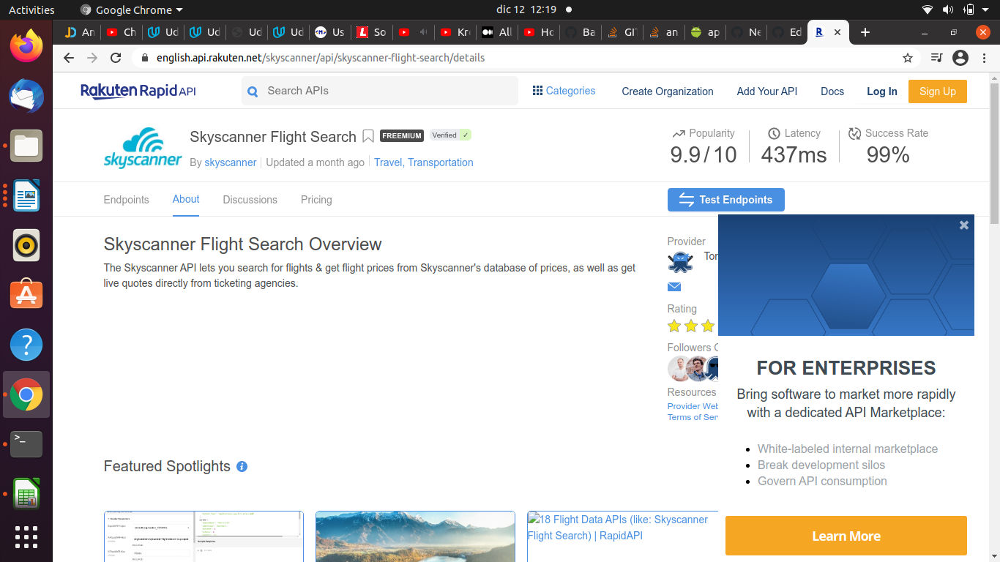
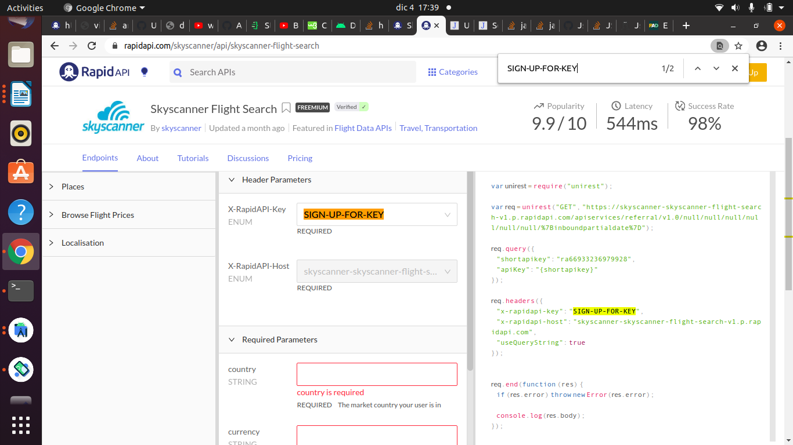
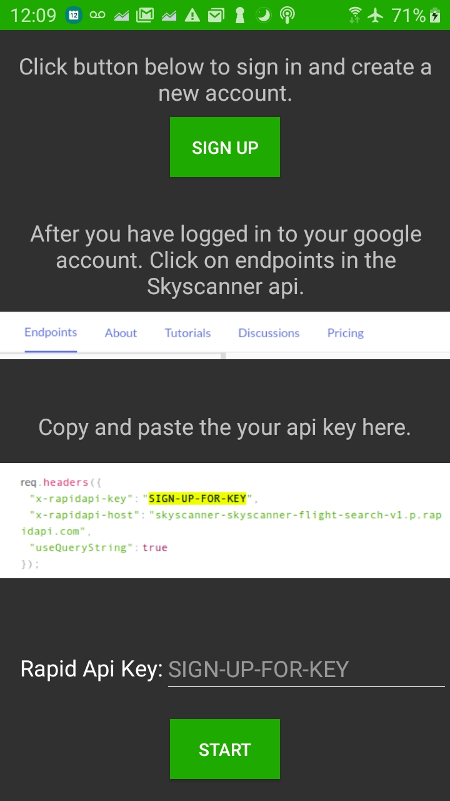
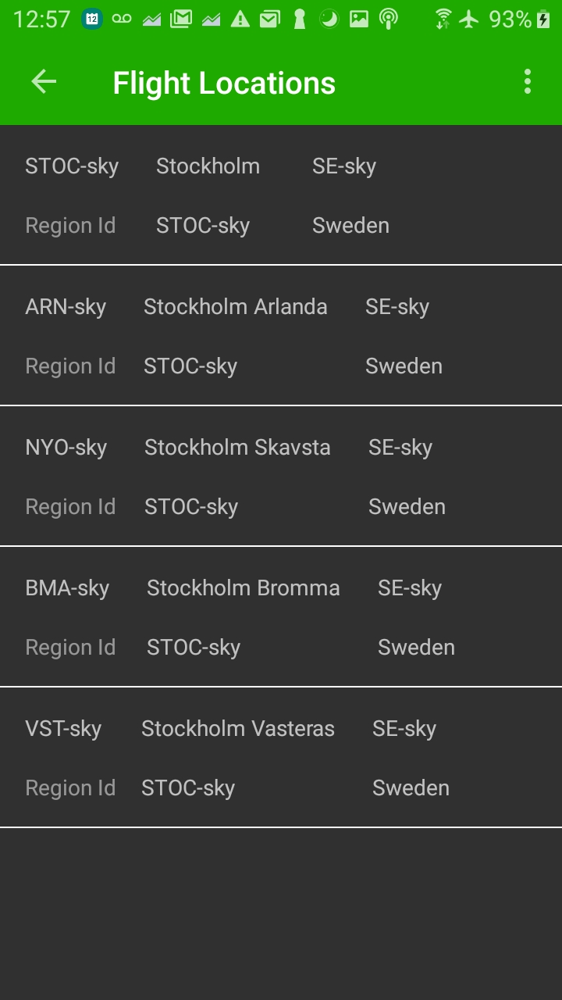
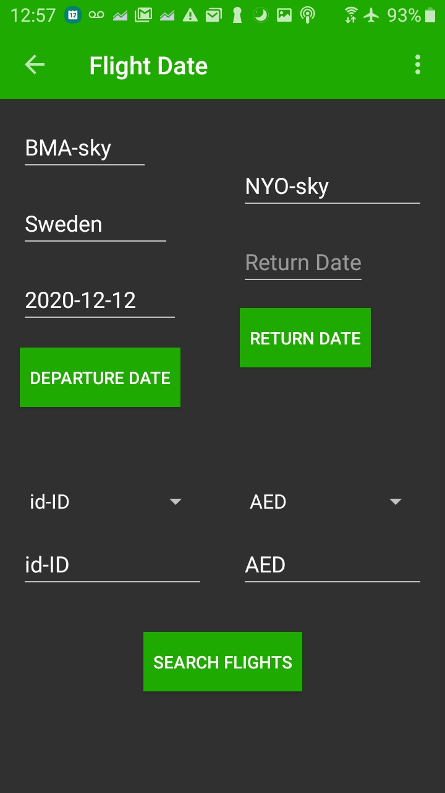

# Flights

## User

Input your origin or have the app take care of it for you. Put in your language and currency. Search by departure and return
date. Save your favorite flights to view them on or offline. 

## How it works
Shared Preferences store the user's unique api key, which will be used to make requests to the Skyscanner api. Google Play Location
Service takes care of using an intent to fill in origin flight location. Spinners take care of the language and currency. Departure date 
and return date can also be filled in by the user. On configuration changes both landscape and portrait mode are supported. AppBar and 
CollapsingToolbarLayout are shown in user favorite flights details screen. App checks for internet connection and for valid api key. All
parameters must be filled in before making a request to the Skyscanner api.

## Set-up
Click on Sign up in the app and you'll be taken to this link https://english.api.rakuten.net/skyscanner/api/skyscanner-flight-search/details  
Sign up in the browser, which is shown in the left image. After signing up for an api key you'll see this screen on the right. 
 | 

Copy your api key and paste it into the SIGN-UP-FOR-KEY field. After that click the START button
and you can start searching for flights. 

## Libraries
- AdMob
- Material
- Timber
- ViewModel
- Lifecycle
- RecyclerView
- OkHTTP3
- Play Services Location
- Multidex
- Firebase Realtime Database
- Firebase UI

## Screenshots

| | 
|  

